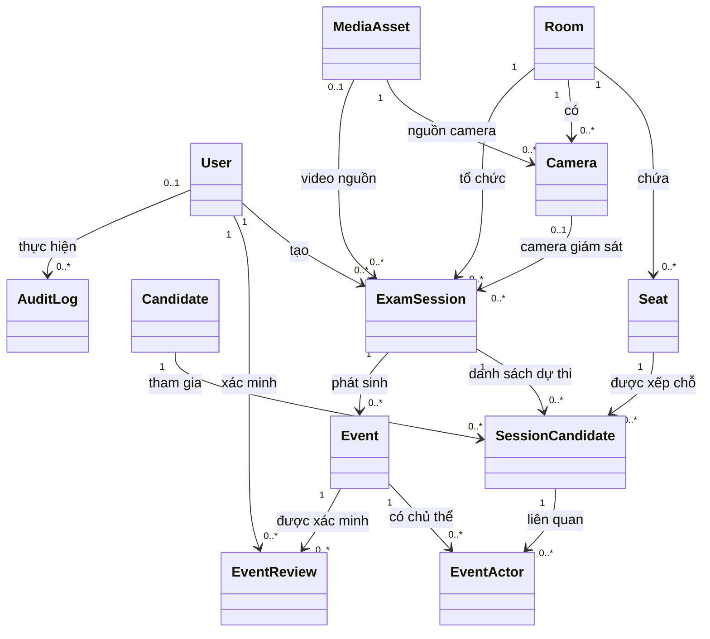

# Mô tả biểu đồ lớp hệ thống ExamGuard

Tài liệu này mô tả các lớp nghiệp vụ đang được ứng dụng ExamGuard sử dụng. Phạm vi được đối chiếu từ model SQLAlchemy trong `backend/app/db/models` và các router/service đang được đăng ký trong `backend/app/api/v1/router.py`.

Một lớp chỉ được đưa vào biểu đồ nghiệp vụ hiện hành khi có luồng ứng dụng đọc hoặc ghi lớp đó. Các model mới chỉ tồn tại trong schema để dành cho giai đoạn phát triển sau không nằm trong biểu đồ này.

## 1. Tổng quan mô hình

Luồng nghiệp vụ trung tâm:

```text
Room ──→ Seat ───────────────┐
  │                          ↓
  ├──→ Camera          SessionCandidate ←── Candidate
  │       ↑                   ↑
  └──→ ExamSession ───────────┘
            │
            └──→ Event ──→ EventActor
                    └─────→ EventReview

MediaAsset ──→ Camera / ExamSession
User ──→ ExamSession / MediaAsset / EventReview / AuditLog
```

Các lớp liên kết quan trọng:

- `SessionCandidate`: liên kết thí sinh, phiên thi và chỗ ngồi.
- `EventActor`: liên kết sự kiện với thí sinh trong đúng phiên thi.
- Track ID không được dùng làm định danh thí sinh lâu dài và không được lưu trong mô hình nghiệp vụ.

## 2. Danh sách lớp chính

### 2.1. User — Người dùng hệ thống

Đại diện cho tài khoản đăng nhập và thực hiện các thao tác nghiệp vụ.

Thuộc tính chính:

| Thuộc tính | Ý nghĩa |
|---|---|
| `id: UUID` | Khóa chính |
| `username` | Tên đăng nhập, duy nhất |
| `password_hash` | Mật khẩu đã băm |
| `full_name` | Họ tên |
| `role` | Vai trò người dùng |
| `is_active` | Trạng thái hoạt động |
| `created_at` | Thời điểm tạo |
| `updated_at` | Thời điểm cập nhật |

Các vai trò:

- `SUPERVISOR`: giám thị, vận hành phiên giám sát.
- `REVIEWER`: xác minh sự kiện.
- `ADMIN`: quản trị hệ thống.

Quan hệ:

- Một `User` có thể tạo nhiều `ExamSession`.
- Một `User` có thể tải lên nhiều `MediaAsset`.
- Một `User` có thể tạo nhiều `EventReview`.
- Một `User` có thể phát sinh nhiều `AuditLog`.

Model: [user.py](../backend/app/db/models/user.py).

### 2.2. Room — Phòng thi

Đại diện cho một phòng thi vật lý.

Thuộc tính chính:

| Thuộc tính | Ý nghĩa |
|---|---|
| `id: UUID` | Khóa chính |
| `code` | Mã phòng, duy nhất |
| `name` | Tên phòng |
| `description` | Mô tả |
| `is_active` | Phòng còn được sử dụng |
| `created_at`, `updated_at` | Dấu thời gian |

Quan hệ:

- Một `Room` có nhiều `Seat`.
- Một `Room` có nhiều `Camera`.
- Một `Room` có nhiều `ExamSession`.
- Mỗi `Seat`, `Camera` và `ExamSession` chỉ thuộc một phòng.

Model: [room.py](../backend/app/db/models/room.py).

### 2.3. Seat — Chỗ ngồi

Mô tả vị trí ghế hoặc bàn thi trong khung hình camera.

Thuộc tính chính:

| Thuộc tính | Ý nghĩa |
|---|---|
| `id: UUID` | Khóa chính |
| `room_id` | Phòng chứa chỗ ngồi |
| `code` | Mã chỗ ngồi trong phòng |
| `x`, `y` | Tọa độ góc trên trái, chuẩn hóa |
| `width`, `height` | Kích thước vùng chỗ ngồi, chuẩn hóa |
| `sort_order` | Thứ tự hiển thị |
| `is_active` | Trạng thái sử dụng |

Ràng buộc:

- Mã chỗ ngồi không được trùng trong cùng phòng.
- `x`, `y`, `width`, `height` nằm trong miền `[0,1]`.
- Vùng chỗ ngồi phải nằm hoàn toàn trong khung hình.

Quan hệ:

- Một `Room` có `0..*` chỗ ngồi.
- Một `Seat` có thể được sử dụng trong nhiều phiên thi khác nhau.
- Trong một phiên, một `Seat` chỉ được gán cho tối đa một thí sinh.

Model: [room.py](../backend/app/db/models/room.py).

### 2.4. Candidate — Thí sinh

Lưu hồ sơ thí sinh độc lập với từng phiên thi.

Thuộc tính chính:

| Thuộc tính | Ý nghĩa |
|---|---|
| `id: UUID` | Khóa chính |
| `candidate_code` | Mã thí sinh, duy nhất |
| `full_name` | Họ tên |
| `class_name` | Lớp học |
| `note` | Ghi chú |
| `created_at`, `updated_at` | Dấu thời gian |

Quan hệ:

- Một `Candidate` có thể tham gia nhiều `ExamSession`.
- Quan hệ nhiều-nhiều giữa `Candidate` và `ExamSession` được biểu diễn bằng `SessionCandidate`.

Model: [candidate.py](../backend/app/db/models/candidate.py).

### 2.5. MediaAsset — Tệp phương tiện

Lưu metadata của video được tải lên hệ thống.

Thuộc tính chính:

| Thuộc tính | Ý nghĩa |
|---|---|
| `id: UUID` | Khóa chính |
| `original_filename` | Tên tệp ban đầu |
| `stored_filename` | Tên tệp lưu trên máy chủ |
| `storage_path` | Đường dẫn lưu trữ |
| `mime_type` | Loại MIME |
| `codec` | Codec video |
| `width`, `height` | Độ phân giải |
| `fps` | Số khung hình mỗi giây |
| `duration_ms` | Thời lượng video |
| `size_bytes` | Kích thước tệp |
| `sha256` | Mã kiểm tra toàn vẹn |
| `created_by` | Người tải tệp |

Quan hệ:

- Một `User` có thể tạo nhiều `MediaAsset`.
- Một `MediaAsset` có thể được dùng làm nguồn cho `Camera`.
- Một `ExamSession` có thể sử dụng một `MediaAsset` làm video nguồn.

Model: [media.py](../backend/app/db/models/media.py).

### 2.6. Camera — Camera giám sát

Đại diện cho nguồn camera được cấu hình cho một phòng thi.

Thuộc tính chính:

| Thuộc tính | Ý nghĩa |
|---|---|
| `id: UUID` | Khóa chính |
| `name` | Tên camera |
| `room_id` | Phòng đặt camera |
| `source_media_asset_id` | Video hoặc nguồn phương tiện của camera |
| `description` | Mô tả |
| `is_active` | Trạng thái hoạt động |

Quan hệ:

- Mỗi `Camera` thuộc đúng một `Room`.
- Mỗi `Camera` tham chiếu một `MediaAsset`.
- Một `Camera` có thể được dùng trong nhiều `ExamSession` ở các thời điểm khác nhau.

Model: [camera.py](../backend/app/db/models/camera.py).

### 2.7. ExamSession — Phiên thi

Là lớp trung tâm, đại diện cho một ca thi được tổ chức tại một phòng cụ thể.

Thuộc tính chính:

| Thuộc tính | Ý nghĩa |
|---|---|
| `id: UUID` | Khóa chính |
| `session_code` | Mã phiên, duy nhất |
| `exam_name` | Tên kỳ thi hoặc môn thi |
| `room_id` | Phòng tổ chức |
| `source_type` | Loại nguồn video |
| `camera_id` | Camera được chọn |
| `video_asset_id` | Video nguồn |
| `status` | Trạng thái phiên |
| `scheduled_start`, `scheduled_end` | Thời gian dự kiến |
| `actual_start`, `actual_end` | Thời gian thực tế |
| `runtime_profile` | Profile AI được sử dụng |
| `created_by` | Người tạo phiên |

Trạng thái:

```text
DRAFT
READY
RUNNING
PAUSED
COMPLETED
CANCELLED
ERROR
```

Loại nguồn:

```text
CAMERA
VIDEO_UPLOAD
```

Quan hệ:

- Mỗi phiên thuộc một `Room`.
- Mỗi phiên do một `User` tạo.
- Một phiên có thể sử dụng một `Camera`.
- Một phiên có thể tham chiếu một `MediaAsset`.
- Một phiên có nhiều `SessionCandidate`.
- Một phiên có nhiều `Event`.

Model: [session.py](../backend/app/db/models/session.py).

### 2.8. SessionCandidate — Thí sinh trong phiên thi

Đây là lớp liên kết giữa `ExamSession`, `Candidate` và `Seat`.

Thuộc tính chính:

| Thuộc tính | Ý nghĩa |
|---|---|
| `id: UUID` | Khóa chính |
| `session_id` | Phiên thi |
| `candidate_id` | Thí sinh |
| `seat_id` | Chỗ ngồi trong phiên |
| `created_at` | Thời điểm phân công |

Ràng buộc:

- Một thí sinh chỉ xuất hiện một lần trong một phiên.
- Một chỗ ngồi chỉ được gán cho một thí sinh trong một phiên.
- Cùng một chỗ ngồi có thể được sử dụng lại ở phiên khác.

Ý nghĩa:

`SessionCandidate` mới là định danh nghiệp vụ của thí sinh trong một ca thi. Track ID của ByteTrack chỉ là định danh tạm thời trong quá trình xử lý video.

Model: [session.py](../backend/app/db/models/session.py).

### 2.9. Event — Sự kiện đáng ngờ

Đại diện cho một phát hiện cần được con người xem xét. Đây không phải kết luận thí sinh gian lận.

Thuộc tính chính:

| Thuộc tính | Ý nghĩa |
|---|---|
| `id: UUID` | Khóa chính |
| `event_code` | Mã sự kiện, duy nhất |
| `session_id` | Phiên thi chứa sự kiện |
| `source` | Nguồn tạo sự kiện |
| `behavior_type` | Loại hành vi |
| `start_ms`, `end_ms` | Khoảng thời gian trong video |
| `peak_ms` | Thời điểm có xác suất cao nhất |
| `ai_confidence` | Độ tin cậy AI trong `[0,1]` |
| `status` | Trạng thái xác minh |
| `created_by` | Người tạo nếu là sự kiện thủ công |

Nguồn sự kiện:

```text
AI
MANUAL
```

Loại hành vi:

```text
SUSPICIOUS_LOOKING
COMMUNICATING
EXCHANGE_OBJECT
USING_PHONE_CHEAT_SHEET
OTHER
```

Trạng thái:

```text
PENDING_REVIEW
CONFIRMED
DISMISSED
NEEDS_REVIEW
DISPUTED
RESOLVED
```

Quan hệ:

- Mỗi `Event` thuộc đúng một `ExamSession`.
- Một `Event` có thể liên quan nhiều `SessionCandidate` thông qua `EventActor`.
- Một `Event` có nhiều `EventReview`.

Model: [event.py](../backend/app/db/models/event.py).

### 2.10. EventActor — Chủ thể liên quan đến sự kiện

Là lớp liên kết giữa sự kiện và thí sinh trong phiên thi.

Thuộc tính chính:

| Thuộc tính | Ý nghĩa |
|---|---|
| `id: UUID` | Khóa chính |
| `event_id` | Sự kiện |
| `session_candidate_id` | Thí sinh trong phiên |
| `role` | Vai trò của chủ thể trong sự kiện |
| `created_at` | Thời điểm liên kết |

Ràng buộc:

- Một `SessionCandidate` chỉ được liên kết một lần với cùng một `Event`.
- Sự kiện có thể chưa có `EventActor` nếu AI chưa xác định được thí sinh.

Quan hệ này hỗ trợ các hành vi nhiều người như trao đổi hoặc giao tiếp.

Model: [event.py](../backend/app/db/models/event.py).

### 2.11. EventReview — Kết quả xác minh sự kiện

Lưu từng lần người có thẩm quyền xem xét một sự kiện.

Thuộc tính chính:

| Thuộc tính | Ý nghĩa |
|---|---|
| `id: UUID` | Khóa chính |
| `event_id` | Sự kiện được xác minh |
| `reviewer_id` | Người xác minh |
| `decision` | Quyết định |
| `note` | Ghi chú |
| `created_at` | Thời điểm xác minh |

Quyết định:

```text
CONFIRM
DISMISS
NEEDS_REVIEW
```

Quan hệ:

- Một `Event` có thể có nhiều bản ghi xác minh.
- Một `User` có thể xác minh nhiều sự kiện.
- Các lần xác minh được lưu riêng để bảo toàn lịch sử.

Model: [event.py](../backend/app/db/models/event.py).

### 2.12. AuditLog — Nhật ký kiểm toán

Lưu dấu vết các thao tác quan trọng trong hệ thống.

Thuộc tính chính:

| Thuộc tính | Ý nghĩa |
|---|---|
| `id: UUID` | Khóa chính |
| `actor_user_id` | Người thực hiện |
| `action` | Hành động |
| `entity_type` | Loại đối tượng bị tác động |
| `entity_id` | ID của đối tượng |
| `metadata` | Dữ liệu bổ sung dạng JSON |
| `created_at` | Thời điểm phát sinh |

Quan hệ:

- Một `User` có thể tạo nhiều `AuditLog`.
- `entity_type` và `entity_id` tạo tham chiếu đa hình đến các đối tượng nghiệp vụ.
- `entity_id` không phải khóa ngoại trực tiếp vì có thể chỉ đến nhiều loại lớp khác nhau.
- Nhật ký kiểm toán được thiết kế theo hướng chỉ ghi thêm, không sửa lịch sử cũ.

Model: [audit.py](../backend/app/db/models/audit.py).

## 3. Các quan hệ chính và bội số

| Lớp nguồn | Quan hệ | Lớp đích | Bội số |
|---|---|---|---|
| `Room` | chứa | `Seat` | `1 — 0..*` |
| `Room` | lắp đặt | `Camera` | `1 — 0..*` |
| `Room` | tổ chức | `ExamSession` | `1 — 0..*` |
| `MediaAsset` | cung cấp nguồn | `Camera` | `1 — 0..*` |
| `MediaAsset` | làm video nguồn | `ExamSession` | `0..1 — 0..*` |
| `Camera` | được sử dụng trong | `ExamSession` | `0..1 — 0..*` |
| `User` | tạo | `ExamSession` | `1 — 0..*` |
| `ExamSession` | có | `SessionCandidate` | `1 — 0..*` |
| `Candidate` | tham gia qua | `SessionCandidate` | `1 — 0..*` |
| `Seat` | được phân công qua | `SessionCandidate` | `1 — 0..*` |
| `ExamSession` | phát sinh | `Event` | `1 — 0..*` |
| `Event` | có chủ thể | `EventActor` | `1 — 0..*` |
| `SessionCandidate` | tham gia sự kiện qua | `EventActor` | `1 — 0..*` |
| `Event` | được xác minh bởi | `EventReview` | `1 — 0..*` |
| `User` | thực hiện | `EventReview` | `1 — 0..*` |
| `User` | thực hiện hành động | `AuditLog` | `0..1 — 0..*` |

## 4. Biểu đồ lớp rút gọn



## 5. Các lớp kỹ thuật và phạm vi lưu trữ

Các lớp kỹ thuật sau đang tham gia trực tiếp vào luồng monitoring nhưng không phải thực thể nghiệp vụ lưu trong PostgreSQL:

```text
MonitoringRuntimeManager
├── VideoAnalysisWorker
│   ├── VideoDecoder
│   ├── AnalysisClock
│   ├── LatestValueBuffer
│   ├── PersonDetector
│   ├── ByteTrackAdapter
│   ├── LogicalTrackManager
│   ├── SeatAssignmentEngine
│   ├── ActionRecognitionRuntime
│   ├── CheatingClassifierRuntime
│   └── EventAggregationRuntime
└── LatestWebSocketPublisher
```

- `MonitoringRuntimeManager` quản lý vòng đời runtime theo từng phiên thi.
- `VideoAnalysisWorker` điều phối giải mã video, lấy mẫu khung hình, nhận diện, tracking, gán chỗ ngồi, nhận dạng hành vi và tổng hợp sự kiện.
- `LatestValueBuffer` giữ ngữ nghĩa latest-frame; khung hình phân tích cũ bị bỏ thay vì tích lũy độ trễ.
- `LatestWebSocketPublisher` phát metadata mới nhất cho giao diện; frontend vẽ overlay bằng Canvas.
- `ActionRecognitionRuntime`, `CheatingClassifierRuntime` và `EventAggregationRuntime` được khởi tạo theo cấu hình runtime.

Trạng thái detection/tracking chỉ nằm trong bộ nhớ. PostgreSQL không có bảng detection, bounding box hoặc tracking frame theo từng khung hình; chỉ `Event` đã đủ điều kiện nghiệp vụ mới được ghi bền vững.

